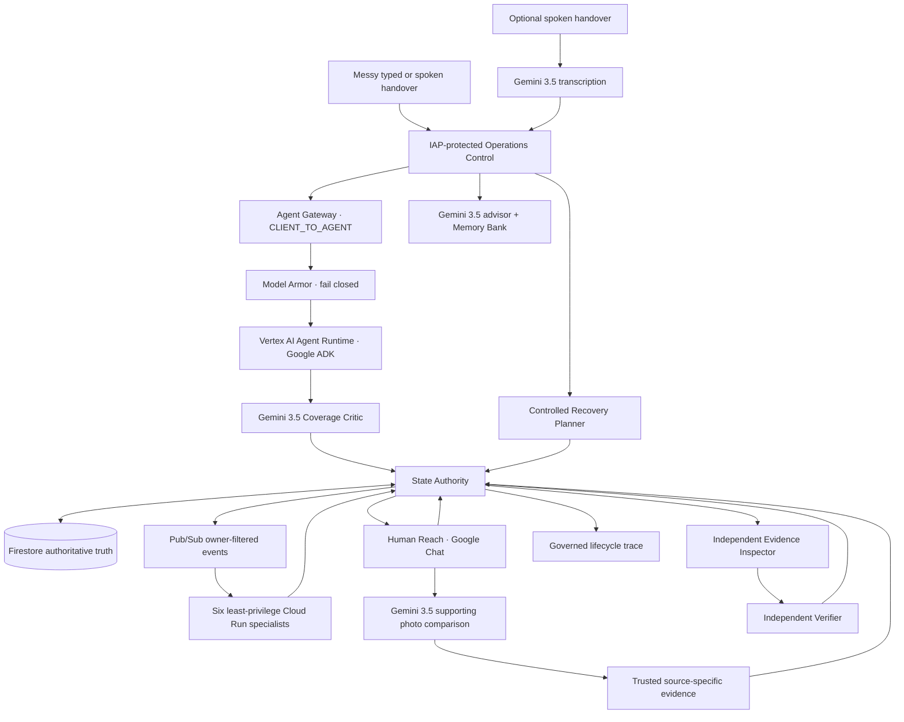

# Next Shift

**The handover ends. The work does not.**

Next Shift is a fortified operational handover and continuity system for 24/7 enterprises. The demonstration uses a fully synthetic, non-clinical hospital operations environment because shift changes make the problem very easy to see, but the architecture is intended for any operation where unfinished work crosses teams, departments, contractors, or shifts.

The basic idea is simple: people should be able to hand over messy real-world information in ordinary language, then leave the system to keep the work moving after their shift ends.

Next Shift does not just summarize that handover. It turns unresolved items into durable operational work, routes each item to the correct least-privilege specialist, coordinates asynchronous work and frontline people, keeps the next shift informed, and refuses to call something complete until trusted evidence has been checked and an independent verifier is allowed to close it.

> **No agent claim is trusted merely because an LLM said it. Operational truth must be persisted, permissioned, and verifiable.**

## Why I built it

Across 24-hour operations, a lot of important work gets carried from one shift to the next in fairly ordinary ways: a note on a whiteboard, a message in a notebook, a chat message, a phone call, or somebody saying, "Hey, that still isn't fixed. I called them again but haven't heard back yet."

The problem is not always that nobody noticed the issue. Often somebody did notice it, somebody did call, and somebody did start doing something about it. The problem is that the shift ends before the work does.

That is the gap Next Shift is designed around.

I chose synthetic hospital operations for the demonstration because it gives a clear mix of 24/7 teams, support departments, outside providers, physical work and handovers without going anywhere near clinical decision-making. The same pattern also exists in hotels, manufacturing, logistics, aviation, utilities, security operations and other continuous businesses.

## What it does

A user can type or speak an ordinary handover such as several unfinished jobs mixed into one paragraph. Gemini 3.5 interprets the handover and proposes separate operational issues.

A separate Gemini 3.5 Coverage Critic then checks the proposals for omissions, duplication, conflated work, routing mistakes and uncertainty before accepted work becomes durable state.

From there:

1. **State Authority** creates and controls authoritative workflow state in Firestore.
2. **Pub/Sub** wakes the correct owner-specific specialist.
3. The specialist can perform only the actions allowed for its identity and owner.
4. Work can continue asynchronously after the original user has left.
5. **Human Reach** sends actionable work to frontline people in Google Chat when human action is required.
6. A worker clicking **Completed** creates a completion claim, not proof.
7. Trusted, source-specific evidence is recorded separately.
8. An **Evidence Inspector** checks that exact evidence.
9. Only the **Independent Verifier** can request the final transition to `CLOSED`.

The canonical successful lifecycle is:

```text
RECEIVED
→ TRIAGED
→ ASSIGNED
→ ACTION_PENDING
→ VERIFYING
→ CLOSED
```

`BLOCKED`, `HUMAN_REVIEW`, and `FAILED` remain visible governed outcomes rather than being hidden behind a reassuring AI response.

## Six operational channels

The deployed demonstration uses six deterministic operational owners:

| Channel | What it handles in the demo | Broader equivalent |
|---|---|---|
| **Facilities** | Repairs, leaks, building and infrastructure issues | Maintenance, site services, workplace infrastructure |
| **Asset Logistics** | Finding and coordinating shared equipment | Tools, machinery, safety equipment, stock or shared assets |
| **Language Access** | Interpreter and communication support | Translation, accessibility and specialist communication support |
| **Discharge DME** | Equipment or dependencies required before a process can finish | Supplier delivery, installation, release or readiness dependencies |
| **EVS Throughput** | Cleaning, reset and room readiness | Turnaround of rooms, workstations, production areas or shared capacity |
| **Patient Transport** | Movement of people or items between locations | Passenger movement, deliveries, pickups and internal logistics |

The human entering the handover does not need to know this schema. Gemini normalizes ordinary language into one proposal per distinct unresolved job. If something genuinely does not belong to one of the six channels, it can be held for operator review rather than being forced into the nearest category.

## The important distinction: claimed is not verified

One of the main ideas in Next Shift is deliberately separating **"someone says it is done"** from **"the system has enough trusted evidence to close it."**

If a frontline worker clicks **Completed**, the issue becomes:

```text
CLAIMED · UNVERIFIED
```

It does not become closed.

For the Facilities demonstration, a worker can reply in the Google Chat work thread with synthetic BEFORE and AFTER images. Gemini 3.5 can compare the visible change, but those images are stored only as supporting visual evidence and cannot close the task.

A separate trusted evidence path must record operational evidence. The Evidence Inspector then checks the exact evidence, and only the Independent Verifier can request `VERIFYING → CLOSED`.

This means a specialist agent cannot certify its own work, a human completion button cannot certify the work, and Gemini cannot certify the work simply because its output sounds confident.

## Architecture



### Authority boundaries

The important part of the diagram is not how many boxes it has. It is who is allowed to do what.

- **Firestore** is authoritative current workflow truth.
- **State Authority** is the sole Next Shift workflow mutation path and sole Firestore writer.
- Specialists are separated by owner and identity.
- Humans and specialists can claim completion but cannot certify it.
- Gemini can interpret, critique, transcribe, compare images and advise, but it cannot establish operational truth.
- Memory Bank is advisory historical context only.
- Recovery Planner is advisory only and cannot mutate state or close work.
- Only the Independent Verifier can request final closure after trusted evidence passes inspection.

## Google platform used

Next Shift deliberately uses Google services where they add something concrete to the architecture rather than adding products only for the sake of a technology list.

- **Gemini 3.5** for managed intake reasoning, spoken-handover transcription, independent coverage critique, supporting visual comparison, and operational improvement advice.
- **Google ADK + Vertex AI Agent Runtime** for managed agent execution with managed Agent Identity.
- **Agent Registry** for the registered Next Shift agent and runtime lifecycle.
- **Agent Gateway + Model Armor** for the governed client-to-agent path and fail-closed content authorization.
- **Cloud Run** for the State Authority, specialist fleet and supporting services.
- **IAM + IAP** for service identity, least privilege and protected operator access.
- **Pub/Sub** for asynchronous owner routing, OIDC push identities, bounded retries, idempotency and dead-letter handling.
- **Firestore** for authoritative state, durable workflow history, evidence references, verification and audit records.
- **Google Chat** for Human Reach and asynchronous frontline coordination.
- **Memory Bank** for advisory historical patterns and operational improvement context.
- **Cloud Logging / Cloud Run telemetry** for inspectable authorization decisions, service revisions, denials and proof records.

All judge-visible model paths in the final demonstration are configured on `gemini-3.5-flash`.

## Security model

The project was built around the idea that agent autonomy should not mean unlimited authority.

Next Shift therefore uses:

- distinct service identities rather than one all-powerful agent identity;
- owner-filtered Pub/Sub subscriptions;
- deterministic capability and state-transition checks;
- State Authority as a single mutation choke point;
- fail-closed Agent Gateway / Model Armor authorization;
- stale-action rejection;
- idempotent event handling;
- bounded retries and dead-letter handling;
- evidence requirements before verification;
- separation between evidence inspection and final verification.

A stale Google Chat completion response against an already closed issue is denied and cannot mutate state. The final security proof also includes a benign gateway request returning `200 / ALLOW` and a controlled instruction-bypass attempt returning `403 / DENY`, with `fail_open=false`.

## Cross-shift continuity and memory

Firestore and Memory Bank deliberately have different jobs.

**Firestore** tells the incoming shift what is true now and preserves the durable workflow history.

**Memory Bank** provides advisory historical context. It can help identify things such as recurring delays, repeated dependencies or work that repeatedly crosses shifts, but it has no authority to change current workflow state.

The Operational Improvement Advisor can turn those historical patterns into plain-English recommendations. For example, if the same equipment shortage repeatedly causes experienced staff to leave their normal work area and spend time searching for an asset, that history may support a very simple management decision: buy another one.

That is much more useful than storing historical data just because the database can store it.

## Reviewer quick start

The repository is private during judging and has been shared with the Devpost and Google hackathon reviewer accounts requested by the competition.

The deployed demonstration lives in Google Cloud project:

```text
next-shift-506004
```

Primary region:

```text
asia-southeast1
```

### 1. Clone the repository

```bash
git clone https://github.com/Paddyboy76/next-shift.git
cd next-shift
```

### 2. Confirm the revision you are reviewing

```bash
git status --short --branch
git branch --show-current
git rev-parse HEAD
git log -1 --oneline
```

The repository's current `main` is the authoritative source for the submitted code. Historical accepted proof records are kept under `docs/autonomy/evidence/`.

### 3. Local Python contract setup

Python 3.12 or newer is required by `pyproject.toml`.

```bash
python3 --version
python3 -m venv .venv
source .venv/bin/activate
python -m pip install --upgrade pip
python -m pip install -e '.[test]'
```

The core package metadata and test dependencies are declared in `pyproject.toml`. Some live integration and deployment paths additionally depend on Google Cloud SDK authentication and the already-provisioned Google Cloud resources described below.

### 4. Run the local contract checks

```bash
source .venv/bin/activate
python -m compileall -q next_shift services workers tests
python -m pytest -q
git diff --check
```

The accepted submission freeze recorded:

```text
152 passed
49 subtests passed
```

### 5. Authenticate Google Cloud for live verification

For a reviewer who has been granted access to the deployed project:

```bash
gcloud auth login
gcloud config set project next-shift-506004
gcloud config get-value project
gcloud auth list
```

Before running any mutating command, verify that the active project is exactly `next-shift-506004`.

### 6. Run the composed submission verification

```bash
bash scripts/verify_submission.sh
```

The accepted submission gate records:

```text
PASS=180
WARN=0
FAIL=0
NEXT_SHIFT_READINESS=PASS
MODEL_ASSERT all_demo_gemini_3_5=true
NEXT_SHIFT_SUBMISSION=PASS
```

This wrapper composes the production readiness checks with the compact model and security proof. It does not suppress IAM, evidence, integration, security, cloud or model failures.

### 7. Run the compact read-only judge proof

```bash
bash scripts/demo_proof_snapshot.sh
```

This is the safest quick inspection command for the deployed product. It is read-only and checks serving Cloud Run revisions and identities, Gemini 3.5 configuration, the latest Gateway / Model Armor allow-deny proof, stale Human Reach denial and the controlled Recovery Planner sanction.

### 8. Inspect the Gateway / Model Armor behavior

```bash
bash scripts/verify_gateway_model_armor_trace.sh
```

This sends a benign synthetic request and a controlled instruction-bypass probe through the governed path. The accepted proof requires:

```text
benign=200/ALLOW
bypass=403/DENY
fail_open=false
```

It does not create operational work in State Authority.

## Deployment and reproducibility

Next Shift is reproducible for the existing synthetic Google Cloud project, but the repository does **not** claim to be a one-command bootstrap of a brand-new Google Cloud organization.

The live system depends on already-provisioned Google Cloud resources including service accounts, IAM bindings, Firestore, IAP, Pub/Sub, Agent Runtime, Agent Gateway, Model Armor, Memory Bank and Google Chat configuration. Recreating a production-style least-privilege fleet from a completely empty organization also requires organization-level authorization and provider configuration that should not be silently automated by a hackathon repository.

For an authorized rebuild of the existing project, first verify the current project, identities and serving revisions:

```bash
gcloud config set project next-shift-506004
gcloud config get-value project

gcloud run services list \
  --project next-shift-506004 \
  --region asia-southeast1 \
  --format='table(metadata.name,status.latestReadyRevisionName,spec.template.spec.serviceAccountName,status.url)'
```

Then rebuild in dependency order:

```bash
python deploy_agent.py
bash deploy_agent_gateway.sh
bash deploy_secure_specialists.sh
bash deploy_critic_inspector.sh
bash deploy_recovery_planner.sh
bash deploy_memory_advisor.sh
bash deploy_chat_photo_proof.sh
```

The deployment is intentionally split into scoped units rather than one giant script because several services have different identities and authority boundaries. Do not blindly redeploy the whole system if only one service has changed.

After an authorized rebuild:

```bash
bash verify_readiness.sh
bash scripts/verify_gateway_model_armor_trace.sh
bash scripts/demo_proof_snapshot.sh
bash scripts/verify_submission.sh
```

For the detailed deployment notes and current service bindings, see [`docs/deployment.md`](docs/deployment.md).

## What the accepted deployed system proves

The final acceptance covers the things I considered most important for a real operational agent system:

- messy multi-item human handovers become separate durable jobs;
- repeated same-owner work remains separate instead of being accidentally merged;
- disputed work can be held without silently losing unrelated safe work;
- spoken Gemini 3.5 handover reaches the same governed intake path;
- completion claims remain unverified;
- stale human actions fail without state mutation;
- Facilities BEFORE / AFTER images can be examined by Gemini without being treated as closure authority;
- trusted evidence, Evidence Inspector and Independent Verifier remain separate;
- Gateway / Model Armor visibly allows a benign request and denies a controlled bypass request;
- Recovery Planner recommendations require separate operational sanction;
- Memory Bank remains advisory rather than becoming workflow truth;
- owner-specific services, service identities and Pub/Sub paths can be inspected in the deployed system.

## Verification documents

The repository keeps the engineering and judging proof separate from this overview so the README does not have to become a wall of internal acceptance logs.

- [`docs/architecture.md`](docs/architecture.md) - architecture, authority boundaries and security model
- [`docs/deployment.md`](docs/deployment.md) - deployment topology and current deployment units
- [`docs/verification.md`](docs/verification.md) - reproducible verification and claim-to-proof map
- [`docs/hackathon-submission.md`](docs/hackathon-submission.md) - submission-focused architecture and wording
- [`docs/demo-script.md`](docs/demo-script.md) - final demonstration flow
- [`docs/autonomy/evidence/`](docs/autonomy/evidence/) - durable engineering acceptance records

Useful verification commands:

```bash
gcloud config set project next-shift-506004
bash scripts/verify_submission.sh
bash scripts/demo_proof_snapshot.sh
```

## Safety and data boundary

Everything in the demonstration is synthetic.

Next Shift uses no real hospital data, branding, screenshots, identifiers, internal systems or proprietary workflows. It is deliberately non-clinical and does not diagnose, prescribe, change medication, perform clinical triage, interpret clinical measurements for treatment, or delegate licensed clinical work.

The hospital environment is a demonstration of the operational handover problem, not a claim that Next Shift is a clinical system.

## Current status

The feature set is submission-frozen. Engineering work is complete except for genuine submission-blocking defects.

The remaining work for the hackathon is presentation and judging: final video, Devpost submission, reviewer access and final verification.

If you are reviewing the project, the best starting points are this README, the architecture diagram above, [`docs/verification.md`](docs/verification.md), and the read-only command:

```bash
bash scripts/demo_proof_snapshot.sh
```

**The handover ends. The work does not.**
