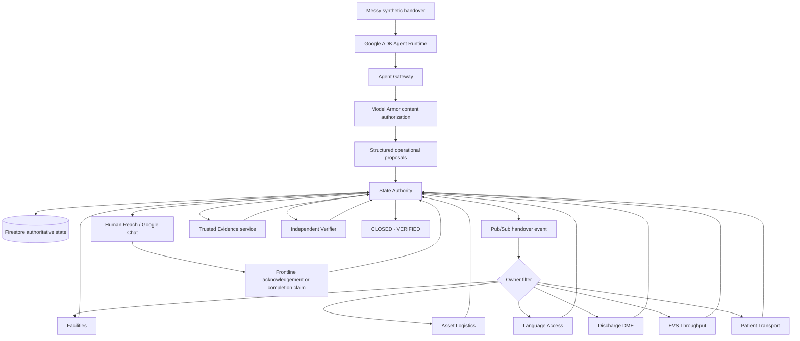

# Next Shift

**Next Shift does not summarize the handover. It finishes the operational work left behind by it.**

Next Shift is a fortified, non-clinical autonomous operations fleet built for Google’s All Things Agentic Hackathon. It turns messy shift handovers into durable operational work, routes each issue to a least-privilege specialist, coordinates frontline action, requires trusted evidence, and uses an independent verifier before closure.

The demo domain is a fully synthetic hospital operations environment. The architecture is intended for any 24/7 enterprise where work crosses shifts and “someone said it was done” is not sufficient proof.

## Why it matters

Handover systems usually preserve information. Next Shift preserves **operational truth** and continues the work.

A single handover can become separate durable issues for:

- Facilities
- Asset Logistics
- Language Access
- Discharge DME
- EVS Throughput
- Patient Transport

Each issue follows the same governed lifecycle:

`RECEIVED → TRIAGED → ASSIGNED → ACTION_PENDING → VERIFYING → CLOSED`

Specialists can progress work but cannot close it themselves. Human completion claims are not treated as trusted evidence. Closure requires a trusted evidence source plus an independent verifier.

## Architecture



## Fortified enterprise controls

Next Shift is designed so the security story is enforced by the platform, not by prompts alone.

- **State Authority is the only Next Shift runtime identity with Firestore write access.**
- Operations UI has read-only Firestore access.
- Specialist workers, Human Reach, trusted evidence, and verifier have no direct Firestore role.
- Every specialist Cloud Run service has a dedicated service account.
- Every production Pub/Sub push subscription has its own OIDC push identity and audience.
- Owner filters prevent the wrong specialist from receiving work.
- State Authority enforces principal, capability, owner and state transition rules.
- Operations UI is protected by IAP.
- Agent Runtime uses managed Agent Identity.
- Agent Gateway governs the client-to-agent path.
- Model Armor is attached through a content authorization policy.
- Retry is bounded to 10–60 seconds and poison events route to a dead-letter queue after 5 attempts.
- Duplicate events are idempotently handled.
- Human Reach responses are rejected when authoritative state has moved on.

A real production acceptance test proved a stale Google Chat completion attempt against an already `CLOSED · VERIFIED` issue was denied with `human_reach_stale_response`, while both Firestore truth and Human Reach history remained unchanged.

## Judge-visible observability

Operators can inspect a governed lifecycle trace for any issue. The trace assembles real authoritative records rather than fabricated telemetry:

- intake/source reference
- handover event/message IDs
- State Authority transition IDs
- specialist principal and capability
- Human Reach delivery/message IDs
- frontline response history
- trusted evidence ID/source
- independent verifier identity
- final verification status

Example route:

`/trace/<issue_id>`

## Live operations UI

The deployed Operations Control interface provides:

- handover intake
- ranked open-work queue
- owner filters
- state and time-in-state
- Human Reach status
- evidence recording
- independent verification
- shift continuity snapshots
- closed/failed history
- governed lifecycle trace

The Operations UI is intentionally not a generic chatbot surface. It shows what the fleet actually did and what remains operationally true.

## Production readiness

The repository includes a read-only verifier:

```bash
bash verify_readiness.sh
```

The final production run completed with:

```text
PASS=159  WARN=0  FAIL=0
NEXT_SHIFT_READINESS=PASS
```

The verifier checks repository state, Cloud Run services and identities, IAP, Firestore authority, Cloud Run invoker isolation, Pub/Sub OIDC/filter/retry/DLQ configuration, stale Human Reach denial audit proof, Agent Runtime, Agent Identity, Agent Gateway, Model Armor and required APIs.

## Deployment assets

Key deployment scripts include:

- `deploy_agent.py` — managed Agent Runtime
- `deploy_agent_gateway.sh` — Agent Gateway + Model Armor path
- `deploy_secure_specialists.sh` — specialist Cloud Run services
- `deploy_human_reach.sh` — Google Chat Human Reach path
- `deploy_intake_path.sh` — intake path
- `deploy_verification_path.sh` — trusted evidence and verifier path
- `verify_readiness.sh` — production readiness verification

## Safety boundary

Next Shift is deliberately non-clinical.

It does not diagnose, prescribe, make clinical triage decisions, interpret clinical measurements for treatment, or delegate licensed clinical work. Prohibited clinical requests are rejected without creating operational work.

All demo data is synthetic. No Bangkok Hospital / BDMS data, branding, screenshots, identifiers, internal systems or proprietary workflows are used.

## Demo story

The strongest demo is one messy synthetic handover containing several simultaneous operational problems: a missing wheelchair, patient transport, a Spanish interpreter, home oxygen, EVS turnaround and a leaking sink.

Next Shift decomposes the handover into separate durable jobs, routes each to the correct least-privilege specialist, coordinates frontline work through Google Chat, refuses to treat a human “Completed” claim as proof, records trusted evidence, independently verifies completion, and closes only verified work.

A prohibited clinical instruction is rejected in the same session to demonstrate the authority boundary.

## Repository truth

`AGENTS.md` documents the canonical project rules and hard boundaries. Repository state and live Google Cloud state are authoritative when older documentation is stale.

See also:

- `docs/architecture.md`
- `docs/demo-script.md`
- `docs/hackathon-submission.md`
