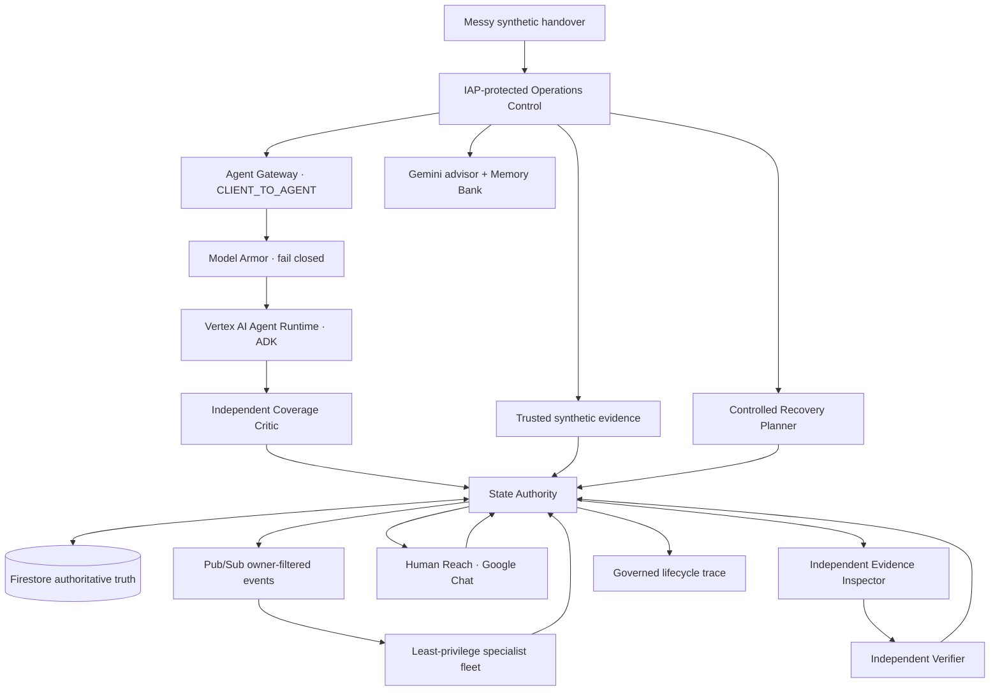

# Next Shift

**Next Shift does not summarize the handover. It finishes the operational work left behind by it.**

Next Shift is a general operational handover and continuity system for 24/7 enterprises, demonstrated in a fully synthetic, non-clinical hospital operations environment. It turns messy handovers into durable work, routes each issue to a least-privilege specialist, coordinates asynchronous action, and refuses to close work until independent evidence and verification requirements are satisfied.

This is not a chatbot or a dashboard wrapped around a model. The model interprets ambiguous language and proposes work; a governed fleet continues that work after the initiating interaction ends. Firestore, deterministic authorization, Pub/Sub delivery, specialist runtimes, external synthetic evidence, and an independent verifier control the lifecycle.

## What the deployed system proves

- One handover can become independent jobs for Facilities, Asset Logistics, Language Access, Discharge DME, EVS Throughput, and Patient Transport.
- A separate Gemini Coverage Critic checks proposed intake for omissions, conflation, duplicates, routing errors, and uncertainty before persistence.
- State Authority is the mutation choke point; the specialist, coordination, evidence, verifier, critic, inspector, and recovery identities cannot write Firestore directly.
- Owner-filtered Pub/Sub subscriptions wake dedicated Cloud Run specialists with OIDC-bound push identities, bounded retry, and dead-letter handling.
- A frontline completion action is `CLAIMED · UNVERIFIED`, not closure.
- Trusted synthetic evidence moves work to `VERIFYING`; a separate Evidence Inspector must pass the exact evidence before the independent verifier can close it.
- Cross-shift snapshots re-read current Firestore state instead of trusting stale handover text.
- A controlled Recovery Planner proposes bounded next actions for delayed or rejected work but cannot mutate state, record evidence, or close work. Operations must sanction the plan.
- Managed Memory Bank stores advisory historical intelligence generated by Gemini. It cannot establish current state or mutate work.
- Agent Registry records the managed ADK runtime lifecycle; Agent Gateway and Model Armor govern the live client-to-agent path.

Canonical lifecycle:

`RECEIVED → TRIAGED → ASSIGNED → ACTION_PENDING → VERIFYING → CLOSED`

`BLOCKED`, `HUMAN_REVIEW`, and `FAILED` are visible governed outcomes. Invalid or unauthorized transitions fail visibly.

## Architecture at a glance



Only State Authority owns workflow mutation, and only the verifier can request `VERIFYING → CLOSED` after exact-evidence inspection passes.

## Google platform leverage

- **Vertex AI Agent Runtime and Google ADK:** managed handover reasoning with managed Agent Identity.
- **Agent Registry:** a real registered `Next Shift` agent and `next-shift-runtime` service linked to the managed runtime.
- **Agent Gateway and Model Armor:** a bound `CLIENT_TO_AGENT` gateway with fail-closed content authorization. A repeatable live probe proves a benign request is allowed and an instruction-bypass request is denied.
- **Gemini:** intake reasoning, independent coverage critique, and evidence-grounded operational improvement recommendations.
- **Cloud Run, IAM, and IAP:** private runtime isolation, service-specific identities, and protected operator access.
- **Pub/Sub:** filtered asynchronous routing, OIDC push, retries, idempotency, and DLQ handling.
- **Firestore:** sole authoritative workflow state and durable audit records.
- **Google Chat:** asynchronous Human Reach; a response is a claim, never proof.
- **Memory Bank:** advisory historical patterns with explicit Firestore provenance and no mutation authority.
- **Cloud Logging / Cloud Run request telemetry:** real request trace/span fields plus durable lifecycle correlation. Native application OTLP spans are not claimed because export could not be authorized in the current project boundary.

## Verify before believing the claims

```bash
gcloud config set project next-shift-506004
bash verify_readiness.sh
```

On clean current `main`, success ends with `NEXT_SHIFT_READINESS=PASS`. During controller-managed phase work only, repository exceptions can be explicit without suppressing cloud failures:

```bash
READINESS_ALLOW_BRANCH=1 READINESS_ALLOW_DIRTY=1 bash verify_readiness.sh
```

The pre-autonomy golden baseline was `159 PASS / 0 WARN / 0 FAIL`. Later phases add checks, so the current pass count can be higher; the authoritative condition is zero warnings, zero failures, and `NEXT_SHIFT_READINESS=PASS` on clean current `main`.

Additional verification:

```bash
bash scripts/verify_gateway_model_armor_trace.sh
source .venv/bin/activate
python -m compileall -q next_shift services workers tests
python -m pytest -q
git diff --check
```

See [deployment](docs/deployment.md), [reproducible verification](docs/verification.md), [architecture and security](docs/architecture.md), [submission wording](docs/hackathon-submission.md), and [demo script](docs/demo-script.md).

## Safety and data boundary

All examples, records, workspaces, integrations, and evidence used by the demonstration are synthetic. The product is non-clinical and does not diagnose, prescribe, triage clinical acuity, interpret clinical measurements for treatment, or delegate licensed clinical work. It uses no real hospital data, branding, screenshots, identifiers, internal systems, or proprietary workflows.
