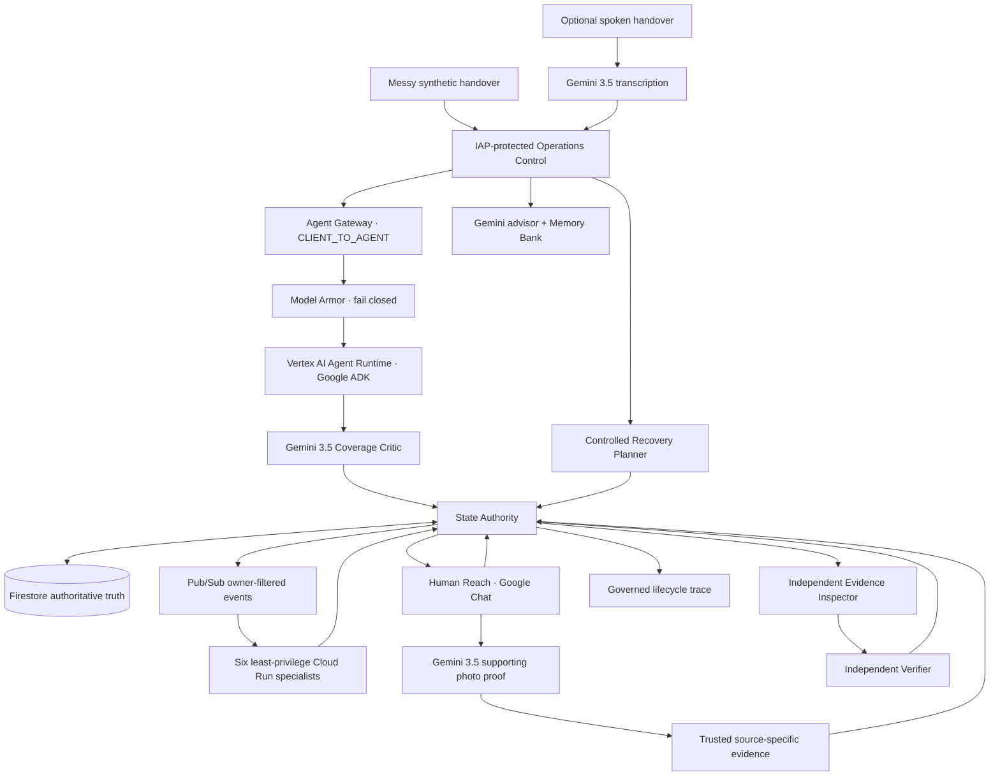

# Next Shift

**The handover ends. The work does not.**

Next Shift is a fortified operational handover and continuity system for 24/7 enterprises, demonstrated in a fully synthetic, non-clinical hospital operations environment.

It turns messy human handovers into durable work, routes each unresolved item to one of six least-privilege operational channels, continues that work asynchronously after the initiating interaction ends, coordinates frontline people in Google Chat, and refuses to close work until trusted evidence and an independent verifier prove it is done.

This is not a summarizer or a collection of chatbots. Gemini interprets messy language, audio, and supporting visual evidence; deterministic contracts, service identities, Firestore, Pub/Sub, State Authority, trusted evidence, and an independent verifier own operational truth.

## What the deployed system proves

- One messy paragraph can become multiple independent jobs across **Facilities, Asset Logistics, Language Access, Discharge Equipment, EVS Throughput, and Patient Transport**.
- Gemini 3.5 normalizes ordinary human shorthand rather than demanding schema-shaped wording. Multiple jobs for the same owner remain separate jobs.
- A separate Gemini 3.5 Coverage Critic checks for omissions, duplication, conflation, routing errors, and uncertainty. Safe work can continue while a disputed proposal is held for review instead of globally vetoing the whole handover.
- Optional spoken handover uses Gemini 3.5 audio understanding to create an editable transcript, expose uncertain phrases, and attach a hash-based audit receipt before the same governed intake path runs.
- State Authority is the mutation choke point. It is the sole Next Shift Firestore writer and enforces principal, capability, owner, state, evidence, and transition rules.
- Owner-filtered Pub/Sub subscriptions wake six dedicated Cloud Run specialists with OIDC-bound push identities, bounded retries, idempotency, and dead-letter handling.
- Human Reach delivers durable work into Google Chat. Cards are refreshed from authoritative Firestore state so stale response buttons disappear after work advances.
- A frontline **Completed** action is only `CLAIMED · UNVERIFIED`.
- For Facilities, the frontline worker can reply in the Google Chat work thread with **BEFORE + AFTER** photos. Gemini 3.5 performs a supporting visual comparison, but the photos cannot close work.
- A separate trusted source-specific evidence identity moves eligible work to `VERIFYING`.
- A separate Evidence Inspector evaluates the exact evidence; only the Independent Verifier can request `VERIFYING → CLOSED`.
- Cross-shift snapshots preserve what crossed the handover while the incoming shift re-reads current Firestore truth.
- A controlled Recovery Planner can recommend a bounded next action for delayed or rejected work, but cannot mutate state, record evidence, change owner, or close anything. Operations must separately sanction the plan.
- Managed Memory Bank stores advisory historical intelligence grounded in synthetic history. It cannot establish current work state or mutate workflow truth.
- Agent Registry records the managed ADK runtime lifecycle; Agent Gateway and fail-closed Model Armor govern the live client-to-agent path.

Canonical lifecycle:

`RECEIVED → TRIAGED → ASSIGNED → ACTION_PENDING → VERIFYING → CLOSED`

`BLOCKED`, `HUMAN_REVIEW`, and `FAILED` are visible governed outcomes. Invalid, stale, or unauthorized actions fail visibly and are auditable.

## Architecture at a glance



Only State Authority owns workflow mutation. Gemini may interpret, critique, transcribe, compare images, or advise; it does not certify operational truth. Only the Independent Verifier can request final closure after trusted evidence passes inspection.

## Google platform leverage

- **Gemini 3.5:** spoken-handover transcription, messy-intake normalization, independent coverage critique, supporting before/after visual comparison, and evidence-linked operational improvement advice.
- **Google ADK + Vertex AI Agent Runtime:** managed agent execution with managed Agent Identity.
- **Agent Registry:** a real registered `Next Shift` agent and `next-shift-runtime` service linked to the managed runtime for governed lifecycle and enterprise discovery.
- **Memory Bank:** persistent advisory historical context across shifts without replacing Firestore current-state truth.
- **Agent Gateway + Model Armor:** a bound `CLIENT_TO_AGENT` gateway with fail-closed content authorization. A controlled live proof records benign HTTP 200 / ALLOW and instruction-bypass HTTP 403 / DENY.
- **Cloud Run + IAM + IAP:** service-specific identities, private runtime isolation, protected operator access, and inspectable serving revisions.
- **Pub/Sub:** asynchronous owner routing, OIDC push identities, bounded retries, idempotency, and DLQ handling.
- **Firestore:** authoritative current state, durable workflow history, evidence references, verification, and audit records.
- **Google Chat:** asynchronous Human Reach and frontline photo-proof capture in the same work thread.
- **Cloud Logging / Cloud Run telemetry:** inspectable security decisions, proof records, request telemetry, service revisions, and durable correlation with the governed lifecycle trace.

## Live acceptance achieved

The final branch acceptance proved all of the following against the deployed project:

- messy multi-item human text routed into durable work;
- repeated same-owner Facilities jobs remained separate;
- disputed work was held without silently losing unrelated safe work;
- spoken Gemini 3.5 handover reached durable governed work end-to-end;
- Human Reach completion claim remained unverified;
- stale Google Chat completion action was denied with `reason=human_reach_stale_response` against a CLOSED issue;
- Facilities BEFORE/AFTER images submitted in Google Chat were compared by Gemini 3.5, stored as supporting evidence, then advanced through separate trusted evidence to independent verification;
- the Independent Verifier closed the issue and the Chat card refreshed to green **Verified complete**;
- Gateway / Model Armor proof recorded benign `200 / ALLOW`, bypass `403 / DENY`, and `fail_open=false`;
- controlled recovery produced a separate auditable `recovery_action_sanctioned` record;
- final branch readiness: **179 PASS / 1 authorized branch warning / 0 FAIL / `NEXT_SHIFT_READINESS=PASS`**.

The final submission condition is stricter: clean current `main`, zero warnings, zero failures, and `NEXT_SHIFT_READINESS=PASS`.

## Verify before believing the claims

```bash
gcloud config set project next-shift-506004
bash verify_readiness.sh
```

Additional verification:

```bash
bash scripts/verify_gateway_model_armor_trace.sh
source .venv/bin/activate
python -m compileall -q next_shift services workers tests
python -m pytest -q
git diff --check
```

See [deployment](docs/deployment.md), [reproducible verification](docs/verification.md), [architecture and security](docs/architecture.md), [submission wording](docs/hackathon-submission.md), and [final demo script](docs/demo-script.md).

## Safety and data boundary

All examples, workspaces, records, images, integrations, and evidence used by the demonstration are synthetic. Next Shift is non-clinical and does not diagnose, prescribe, triage clinical acuity, interpret clinical measurements for treatment, or delegate licensed clinical work. It uses no real hospital data, branding, screenshots, identifiers, internal systems, or proprietary workflows.
