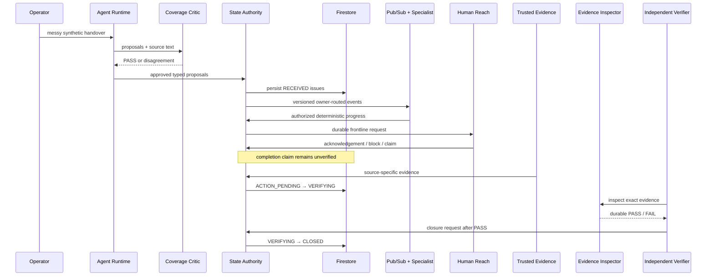

# Next Shift architecture, authority, and security model

## Product boundary

Next Shift is a general operational handover and continuity system for 24/7 enterprises. The demonstration domain is fully synthetic, non-clinical hospital operations.

| Concern | Component | Authority |
|---|---|---|
| Interpret ambiguous text | Managed ADK Agent Runtime | Proposes typed work; cannot establish workflow truth |
| Check intake completeness | Independent Coverage Critic | Passes or reports disagreement; cannot create work directly |
| Own current workflow state | State Authority + Firestore | Sole mutation path and authoritative truth |
| Execute owner-specific work | Six Cloud Run specialists | Requests only allowed owner/capability transitions |
| Coordinate frontline action | Human Reach / Google Chat | Records acknowledgements, blocks, and unverified claims |
| Prove an external event | Trusted synthetic evidence service | Records source-specific evidence; cannot close work |
| Inspect evidence quality | Independent Evidence Inspector | Evaluates the exact evidence and persists PASS/FAIL |
| Certify closure | Independent Verifier | Sole caller allowed to request `VERIFYING → CLOSED` |
| Recover delayed/rejected work | Controlled Recovery Planner | Advisory plan only; requires Operations sanction |
| Learn historical patterns | Gemini advisor + Memory Bank | Advisory history only; cannot establish current state |

## Governed lifecycle

The initiating user need not stay connected. Work persists, events wake specialists, current-state checks make workflows resumable, and closure remains independently controlled.

## Governed model ingress

Operations Control is private behind IAP. Managed Agent Runtime uses Agent Identity and is represented in Agent Registry. The runtime is bound to `next-shift-ingress`, an Agent Gateway configured for `CLIENT_TO_AGENT`. A `CONTENT_AUTHZ` policy calls regional Model Armor prompt-injection/jailbreak filtering with fail-open disabled.

The production proof is behavioral: the same `reasoningEngines:streamQuery` endpoint returned HTTP 200 for a benign synthetic handover and HTTP 403 for a controlled instruction-bypass probe. The proof logs decisions and resource identifiers, never prompt bodies.

## Work execution and reliability

The handover topic fans out through six owner-filtered push subscriptions. Each path has dedicated specialist and push identities, an exact Cloud Run audience, 10–60 second retry backoff, five maximum delivery attempts, and the shared dead-letter topic.

Versioned contracts, processed-event records, current-state checks, and transactional transitions provide resumability and idempotency. Acceptance evidence includes a duplicate event acknowledged without duplicate mutation and a malformed event reaching the DLQ after bounded retry.

## Least privilege

State Authority is the only Next Shift runtime identity with Firestore write access. Operations has viewer access. Specialists, Human Reach, trusted evidence, verifier, Coverage Critic, Evidence Inspector, and Recovery Planner have no direct Firestore data roles.

State Authority validates principal, capability, owner, current state, requested transition, and evidence prerequisites. Unauthorized actions produce durable `authorization.decision` denials without state mutation. Narrow Cloud Run invoker bindings and Pub/Sub OIDC audiences reinforce that boundary.

## Evidence independence

1. A specialist or frontline person may claim action, but work remains unverified.
2. A trusted source-specific synthetic integration records evidence and moves eligible work to `VERIFYING`.
3. The verifier calls a separately authenticated Evidence Inspector for that exact evidence ID; only an inspection PASS permits closure.

Evidence, inspector, and verifier identities have no direct Firestore role and distinct State Authority capabilities. Independence is visible in IAM, durable records, and the lifecycle trace.

## Controlled recovery

For delayed `ACTION_PENDING`, `BLOCKED`, `HUMAN_REVIEW`, or rejected verification paths, Recovery Planner reads bounded authoritative context and writes a recommendation with an allowlisted action and observed state. It cannot change owner, record evidence, mutate issue state, or close work. Operations must sanction the exact plan, and sanction fails if observed state is stale. Execution returns to the trusted-evidence and verifier path.

## Memory and lifecycle

Agent Registry contains the real managed `Next Shift` agent and `next-shift-runtime` service linked to the ADK reasoning engine. Memory Bank stores Gemini-generated improvement advice grounded in exact synthetic Firestore references and prior managed memory facts.

Memory is `ADVISORY_ONLY`, identifies Firestore as current-state authority, and declares `may_mutate_workflow=false`.

## Observability truth

The `/trace/<issue_id>` route assembles real durable correlation records: intake reference, event/message IDs, transitions, principals, capabilities, Human Reach, evidence, inspection, verification, recovery sanction, and final state. Cloud Run logs provide real platform trace/span identifiers separately.

These are not presented as one fabricated distributed trace. Native application OTLP export was attempted but denied at the available permission boundary, so no exported application spans are claimed. The product retains truthful Cloud Run telemetry and authoritative lifecycle correlation.

## Safety boundary

The fleet accepts only non-clinical operational work. Diagnosis, prescribing, clinical acuity decisions, treatment interpretation, and licensed clinical delegation are outside its authority. All demonstration data and integrations are synthetic.
