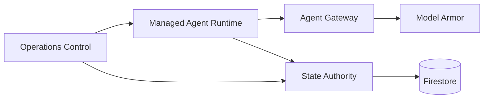
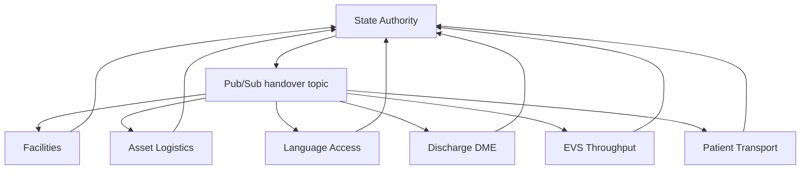
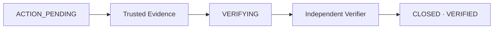

# Next Shift architecture and security model

## Architectural principle

Next Shift separates **reasoning**, **operational authority**, **frontline coordination**, and **proof of completion**.

The LLM can interpret a messy handover and propose work. It does not own operational truth. Firestore does. Every mutation of that truth is mediated by State Authority.

## Control plane

The Agent Runtime uses managed Agent Identity. The client-to-agent path is bound to the `next-shift-ingress` Agent Gateway. Model Armor is attached through a `CONTENT_AUTHZ` custom authorization policy for request and response screening.

## Work execution plane

Each specialist has:

- a dedicated Cloud Run service
- a dedicated runtime service account
- a dedicated Pub/Sub push service account
- an owner-filtered production subscription
- OIDC push audience bound to the intended Cloud Run URL
- retry backoff of 10–60 seconds
- dead-letter routing after 5 attempts

The specialist does not write Firestore directly. It requests a deterministic transition from State Authority.

## Human Reach

When work reaches `ACTION_PENDING`, State Authority can stage a Human Reach delivery. A dedicated Human Reach Cloud Run service delivers the work into one of two durable Google Chat spaces:

- **Next Shift - Facilities Ops** — Facilities, AssetLogistics, EVSThroughput
- **Next Shift - Patient Flow** — LanguageAccess, DischargeDME, PatientTransport

Human responses can acknowledge, block or claim completion. They do not close work.

A stale Human Reach response is rejected if authoritative issue state is no longer `ACTION_PENDING`. This is enforced transactionally by State Authority and emits an auditable `authorization.decision` denial.

## Evidence and verification

Evidence and verifier services have no direct Firestore role. They invoke State Authority.

The closure invariant is:

> A specialist claim or human completion claim is not sufficient evidence. `VERIFYING → CLOSED` requires trusted evidence and an independent verifier.

## Firestore authority

Live IAM verification proves:

- `ns-state-authority` is the only Next Shift runtime identity with `roles/datastore.user`.
- `ns-operations-ui` has `roles/datastore.viewer` only.
- specialist workers, Human Reach, trusted evidence and verifier have no datastore role.

This makes State Authority the technical mutation choke point.

## Cloud Run invocation boundaries

Production invoker bindings are narrowly scoped:

- each specialist is invoked only by its matching `ns-push-*` identity
- Human Reach is invoked only by `ns-push-human-reach`
- trusted evidence and verifier are invoked only by Operations
- Operations is invoked only by the IAP service agent
- State Authority is invokable only by the explicitly authorized internal runtime identities

## Reliability

The event path provides:

- versioned events
- owner routing metadata
- owner-filtered subscriptions
- idempotent duplicate handling
- bounded retry
- dead-letter queue
- resumable workflows
- current-state checks before mutation

Acceptance testing proved a malformed event retried five times and reached the dead-letter review subscription, while a duplicate valid event was ACKed without duplicate state mutation.

## Observability

The `/trace/<issue_id>` view is a judge-visible authoritative lifecycle trace. It combines Firestore issue history, transition-event records, Human Reach data and evidence records. Cloud Run request traces remain available separately in Cloud Logging.

The lifecycle trace intentionally does not pretend that unrelated Cloud Run requests share one distributed trace ID. It presents the real durable correlation chain instead.

## Safety boundary

The system is synthetic and non-clinical. It rejects authority over diagnosis, prescribing, clinical triage, treatment interpretation and licensed clinical work. This boundary is preserved across prompt behavior, Model Armor screening and deterministic operational routing.
