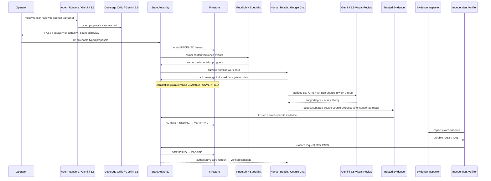

# Next Shift architecture, authority, and security model

## Product boundary

Next Shift is a general operational handover and continuity system for 24/7 enterprises. The demonstration domain is fully synthetic, non-clinical hospital operations.

The product separates **reasoning** from **authority**. Gemini may interpret, transcribe, critique, compare images, or advise. Operational truth is established only through persisted state, deterministic authorization, trusted evidence, and independent verification.

| Concern | Component | Authority |
|---|---|---|
| Normalize messy handover text | Managed ADK Agent Runtime + Gemini 3.5 | Proposes typed work; cannot establish workflow truth |
| Transcribe spoken handover | Gemini 3.5 | Produces editable transcript + audit receipt; operator review required |
| Check intake completeness | Independent Gemini 3.5 Coverage Critic | Finds missed/duplicated/conflated/misrouted/uncertain work; cannot create work directly |
| Own current workflow state | State Authority + Firestore | Sole mutation path and authoritative truth |
| Execute owner-specific work | Six Cloud Run specialists | Requests only allowed owner/capability transitions |
| Coordinate frontline action | Human Reach / Google Chat | Records acknowledgement, block, and unverified completion claim |
| Compare Facilities photo proof | Gemini 3.5 visual reviewer | Supporting evidence only; cannot establish closure |
| Prove an external event | Trusted synthetic evidence service | Records source-specific evidence; cannot close work |
| Inspect evidence quality | Independent Evidence Inspector | Evaluates exact evidence and persists PASS/FAIL |
| Certify closure | Independent Verifier | Sole caller allowed to request `VERIFYING → CLOSED` |
| Recover delayed/rejected work | Controlled Recovery Planner | Advisory plan only; requires separate Operations sanction |
| Learn historical patterns | Gemini advisor + Memory Bank | Advisory history only; cannot establish current state |

## Canonical operational channels

The fleet exposes six deterministic operational owners:

1. `Facilities`
2. `AssetLogistics`
3. `LanguageAccess`
4. `DischargeDME`
5. `EVSThroughput`
6. `PatientTransport`

The human does not need to know this schema. The intake layer absorbs ordinary shorthand, repeated same-owner jobs, and uncertainty about exact failed components, then emits one canonical proposal per distinct unresolved job. The Coverage Critic is a second independent Gemini call. It may preserve advisory uncertainty while safe work continues; blocking duplicate/conflated/misrouted findings are bounded to concrete proposals rather than globally vetoing unrelated work.

## Governed lifecycle

The initiating user does not need to stay connected. Work persists in Firestore, events wake specialists asynchronously, current-state checks make workflows resumable, and the final closure decision stays independent.

## Governed model ingress

Operations Control is private behind IAP. The managed ADK Agent Runtime uses managed Agent Identity and is represented in Agent Registry. The runtime is bound to `next-shift-ingress`, an Agent Gateway configured for `CLIENT_TO_AGENT`. A `CONTENT_AUTHZ` policy invokes regional Model Armor prompt-injection/jailbreak filtering with fail-open disabled.

The live behavioral proof exercises the same `reasoningEngines:streamQuery` path twice:

- benign synthetic handover → HTTP `200`, decision `ALLOW`;
- controlled instruction-bypass attempt → HTTP `403`, decision `DENY` from Model Armor.

The proof is emitted as a structured Cloud Logging record with runtime identity, gateway, policy, template, decision, status, trace ID, and `fail_open=false`; prompt bodies are not logged.

## Work execution and reliability

The handover topic fans out through six owner-filtered push subscriptions. Each path has a dedicated specialist identity and push identity, exact Cloud Run OIDC audience, 10–60 second retry backoff, five maximum delivery attempts, and a shared dead-letter topic.

Versioned contracts, processed-event records, current-state checks, and transactional State Authority transitions provide resumability and idempotency. Acceptance includes duplicate event acknowledgement without duplicate mutation and malformed-event delivery to the DLQ after bounded retry.

## Least privilege

State Authority is the only Next Shift runtime identity with Firestore write access. Operations has Firestore viewer access. Specialists, Human Reach, trusted evidence, verifier, Coverage Critic, Evidence Inspector, and Recovery Planner do not write Firestore directly.

State Authority validates principal, capability, owner, current state, requested transition, freshness, and evidence prerequisites. Unauthorized or stale actions produce durable `authorization.decision` records without state mutation.

Narrow Cloud Run invoker bindings reinforce the application policy. Examples in the final deployed graph include:

- Pub/Sub push identity → Human Reach delivery endpoint;
- Operations identity → Human Reach authoritative card refresh;
- Operations identity → Trusted Evidence for operator acceptance controls;
- Human Reach identity → Trusted Evidence after accepted Chat photo proof;
- Verifier identity → Evidence Inspector;
- Operations identity → Recovery Planner;
- all workflow mutations → State Authority only.

## Human Reach and authoritative Chat state

Google Chat is a frontline coordination surface, not workflow authority.

A work card contains WHO / WHAT / WHERE / work order plus the current governed status. Frontline actions can acknowledge, block, or report completion while the issue remains `ACTION_PENDING`. After work advances, Human Reach re-reads State Authority and refreshes the same card so stale response controls disappear.

A stale response against a CLOSED issue is denied. Final acceptance produced an auditable `DENY` with `reason=human_reach_stale_response`, expected `ACTION_PENDING`, current `CLOSED`, and no workflow mutation.

## Facilities photo proof

Facilities provides a concrete multimodal proof path without weakening the evidence model:

1. Frontline worker reports **Completed** in the Google Chat work card.
2. Human Reach keeps the issue `CLAIMED · UNVERIFIED` and requests exactly two images in that job thread: **BEFORE** then **AFTER**.
3. Gemini 3.5 compares only visible change. It may report `completion_supported=true` only when the images appear to show the same subject/location, a visible problem before, and a visible correction after.
4. Images are stored privately with hashes and inspection metadata as `SUPPORTING_VISUAL_EVIDENCE_ONLY`; `may_close_work=false`.
5. A separate trusted Facilities evidence identity records source-specific completion evidence.
6. State Authority moves the issue to `VERIFYING`.
7. Evidence Inspector evaluates the exact trusted evidence.
8. Independent Verifier alone requests `CLOSED`.
9. Human Reach refreshes the same Chat card to green **Verified complete**.

The photo model can support a repair; it cannot certify closure.

## Evidence independence

The closure chain is deliberately separated:

1. specialist or frontline claim → not proof;
2. optional Gemini visual comparison → supporting evidence only;
3. trusted source-specific integration → operational evidence;
4. independent Evidence Inspector → exact-evidence quality gate;
5. Independent Verifier → only identity allowed to request final closure.

This separation is visible in IAM, State Authority capabilities, durable records, Chat state, and the governed lifecycle trace.

## Controlled recovery

For delayed `ACTION_PENDING`, `BLOCKED`, `HUMAN_REVIEW`, or rejected verification paths, Recovery Planner reads bounded authoritative context and writes an allowlisted recommendation against the observed state. It cannot change owner, record evidence, mutate issue state, or close work. Operations separately sanctions the exact plan; sanction fails if the observed state is stale. Execution then returns to fresh trusted evidence and independent verification.

Final acceptance produced a real `recovery.sanction` ALLOW record with `reason=recovery_action_sanctioned` while preserving the no-mutation/no-closure planner boundary.

## Cross-shift context, Registry, and Memory Bank

Cross-shift continuity is built around two different kinds of memory:

- **Firestore:** authoritative current operational truth, including unresolved work that survives a shift boundary;
- **Memory Bank:** persistent advisory historical context and recurring operational patterns.

Incoming shifts re-read current Firestore state rather than trusting a stale snapshot. Memory Bank may explain patterns from prior synthetic history, but explicitly declares Firestore as current-state authority and `may_mutate_workflow=false`.

Agent Registry contains the managed `Next Shift` agent and `next-shift-runtime` service linked to the ADK reasoning engine, providing a governed lifecycle/discovery record for enterprise use.

## Observability

Operators and judges can inspect the system at two layers:

- `/trace/<issue_id>` assembles durable lifecycle correlation across intake, event, route, specialist, Human Reach, evidence, inspector, verifier, recovery, principals, capabilities, and final state;
- Cloud Logging and Cloud Run expose real serving revisions, request telemetry, authorization decisions, stale-action denials, Gateway/Model Armor proof records, and recovery sanction records.

The product does not fabricate a single synthetic distributed trace. Exact observability limitations and reproducible proof commands are documented in `docs/verification.md`.

## Final acceptance record

The final Aug 27 live acceptance—including Gemini 3.5 speech, authoritative Google Chat state, Facilities photo proof, stale-action denial, Gateway/Model Armor 200/403 proof, recovery sanction, serving revisions, and `179 PASS / 1 authorized branch warning / 0 FAIL` readiness—is recorded in `docs/autonomy/evidence/100-final-product-acceptance-20260827.md`.

## Safety boundary

The fleet accepts only non-clinical operational work. Diagnosis, prescribing, clinical acuity decisions, treatment interpretation, and licensed clinical delegation are outside its authority. All demonstration text, audio, images, workspaces, and integrations are synthetic.
